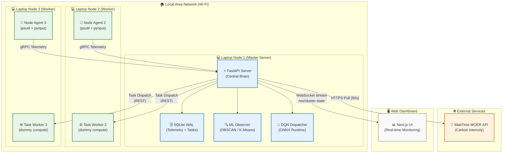
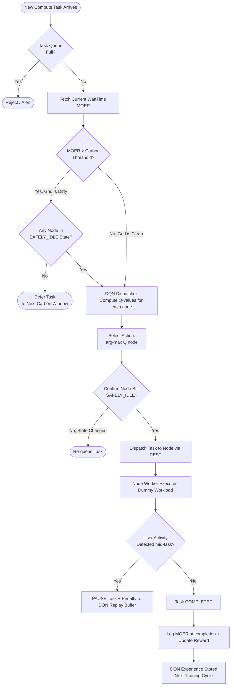
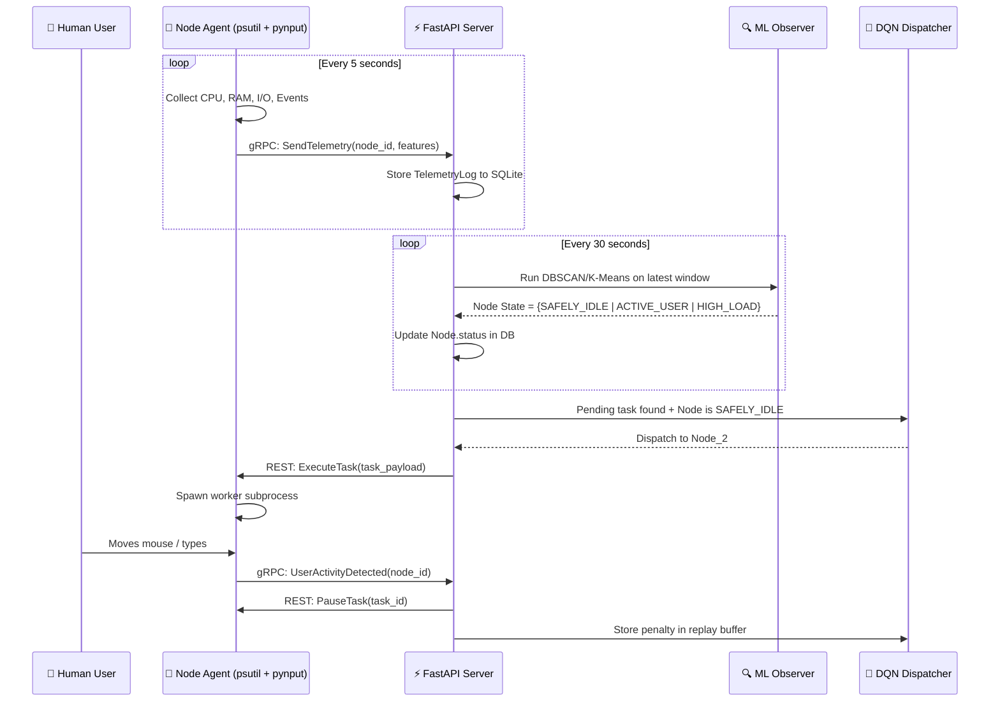
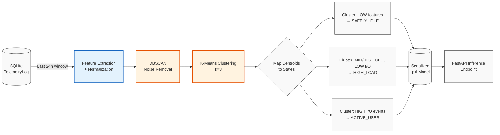
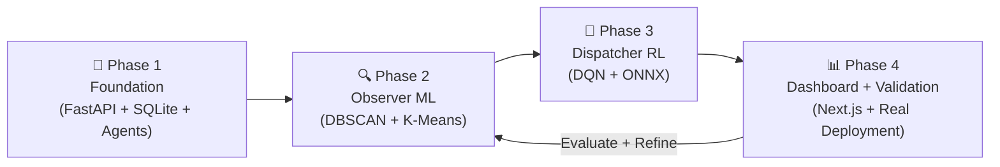

# GridMind: A Carbon-Aware Distributed Workstation Scheduler Using Unsupervised and Reinforcement Learning

**Course Project Proposal & Technical Design Document**
**Date:** February 27, 2026 | **Institution:** Ramaiah Institute of Technology

---

## 1. Revised Project Title

> **GridMind: An Adaptive, Carbon-Aware Distributed Workstation Scheduling System Using Federated Telemetry, Unsupervised Behavioral Profiling, and Deep Reinforcement Learning**

### Justification for Title Change
The original title "EcoSync" was overly generic. The revised title "GridMind" communicates three key differentiators explicitly:
- **Grid** → Real-time power grid carbon intensity awareness (via WattTime API)
- **Mind** → The intelligence layer: ML-driven decision making (K-Means/DBSCAN + DQN)
- **Distributed Workstation Scheduler** → Precisely scopes the system domain (LAN-based PCs, not cloud)

This title directly aligns with IEEE and ACM conference naming conventions and signals technical depth to evaluators.

**UN SDG Alignment:**
- 🌱 **SDG 7** – Affordable and Clean Energy (shifting compute to renewable windows)
- 🏭 **SDG 9** – Industry, Innovation and Infrastructure (smart distributed infrastructure)
- 🌍 **SDG 13** – Climate Action (reducing operational carbon footprint)

---

## 2. Project Objectives & Goals

### 2.1 Project Objectives (Problems Solved)
1. **The Wasted Compute Problem:** Harvest the massive "dark capacity" of idle consumer laptops to run background tasks at zero additional hardware costs.
2. **The "Fake Idle" Problem:** Replace naive CPU-threshold idle detection with intelligent, unsupervised behavioral profiling that accurately identifies when a machine is genuinely free.
3. **The Carbon-Blind Problem:** Integrate live power grid emissions data to actively shift background jobs to periods of high renewable energy availability.
4. **The Static AI Problem:** Develop a dispatcher that uses real-time environmental volatility as a live penalty, rather than relying on static, pre-trained heuristics.
5. **The Cloud Dependency Problem:** Prove that complex distributed scheduling can run entirely on off-the-shelf consumer LAN hardware without expensive cloud orchestration tools.

### 2.2 Project Goals (Implementation Targets)
1. **Design and implement a lightweight central scheduling server** using FastAPI and SQLite (WAL mode) that can orchestrate compute tasks across 2–3 LAN-connected consumer laptops without cloud dependencies.
2. **Develop a cross-platform Node Telemetry Agent** using `psutil` and input-activity monitoring that reports real-time CPU, RAM, and user interaction data to the central server through gRPC/REST.
3. **Implement an Unsupervised ML "Observer" pipeline** using K-Means / DBSCAN on node telemetry to classify machine states into `ACTIVE_USER`, `SAFELY_IDLE`, and `HIGH_LOAD` — without requiring pre-labeled data.
4. **Train and deploy a Deep Q-Network (DQN) "Dispatcher" agent** that learns to optimally route pending compute tasks to nodes, using a multi-objective reward function balancing: task throughput, real-time carbon intensity (WattTime MOER), and penalties for user disruption.
5. **Integrate the WattTime Marginal Operating Emissions Rate (MOER) API** to provide real-time carbon intensity signals, enabling temporal load shifting to cleaner energy windows.
6. **Build a real-time web dashboard** (Next.js + WebSockets) to visualize cluster health, carbon metrics, and task lifecycle events for monitoring and demonstration.
7. **Validate the system** on a real 3-node local Wi-Fi network of student laptops, demonstrating measurable reduction in task-attributed carbon intensity compared to naive round-robin scheduling.


---

## 3. Literature Survey / Related Work

<table style="width: 100%; font-size: 0.9em; display: table;">
  <thead>
    <tr>
      <th style="width: 3%;">Sl.</th>
      <th style="width: 15%;">Authors</th>
      <th style="width: 25%;">Paper Title</th>
      <th style="width: 15%;">Publisher</th>
      <th style="width: 5%;">Year</th>
      <th style="width: 37%;">Key Limitation</th>
    </tr>
  </thead>
  <tbody>
    <tr><td>1</td><td>Dr. Srigouri Kosuri et al.</td><td>Creating an Energy-Aware Cloud Platform to Optimize Carbon Footprint...</td><td>IEEE/Springer/ACM</td><td>2025</td><td>Relies on specific datasets; no real-world deployment validation; scalability untested.</td></tr>
    <tr><td>2</td><td>Z. Wang et al.</td><td>Reinforcement Learning Based Task Scheduling for Environmentally Sustainable Federated Cloud Computing</td><td>Springer</td><td>2023</td><td>Relies on predefined state features and static reward structure. No live carbon streams.</td></tr>
    <tr><td>3</td><td>K. Zhang et al.</td><td>GreenDRL: Managing Green Datacenters Using Deep Reinforcement Learning</td><td>ACM SoCC</td><td>2022</td><td>Optimizes energy inside a single datacenter; no real-time grid awareness or multi-region routing.</td></tr>
    <tr><td>4</td><td>Ana Radovanović et al.</td><td>Carbon-Aware Computing for Datacenters</td><td>IEEE Trans. Power Systems</td><td>2023</td><td>Uses forecast-based optimization, not autonomous adaptive learning; requires accurate prediction models.</td></tr>
    <tr><td>5</td><td>Hardik Ruparel</td><td>Carbon-Aware Scheduling and Distributionally Robust Optimization for Cloud Systems</td><td>IEEE CloudCom</td><td>2025</td><td>Complex optimization model; scalability and real-time implementation challenges.</td></tr>
    <tr><td>6</td><td>T. Bahreini et al.</td><td>A Carbon-aware Workload Dispatcher in Cloud Computing Systems</td><td>IEEE CLOUD</td><td>2023</td><td>Approximation algorithms may not scale efficiently for massive cloud workloads.</td></tr>
    <tr><td>7</td><td>S. Chopdar et al.</td><td>Carbon-Aware AI Workload Scheduling with Renewable Energy Sources</td><td>IEEE ICECONF</td><td>2025</td><td>Simulated evaluation only; lacks real-world production deployment validation.</td></tr>
    <tr><td>8</td><td>E. Rodrigues et al.</td><td>Carbon-Aware Temporal Data Transfer Scheduling Across Cloud Datacenters</td><td>IEEE CLOUD</td><td>2025</td><td>Focuses only on data transfers; excludes compute workload interactions.</td></tr>
    <tr><td>9</td><td>J. Park et al.</td><td>Carbon-Aware and Fault-Tolerant Migration of Deep Learning Workloads...</td><td>IEEE CLOUD</td><td>2024</td><td>Frequent migrations may introduce overhead and increased transfer costs.</td></tr>
    <tr><td>10</td><td>K. West et al.</td><td>Exploring the Potential of Carbon-Aware Execution for Scientific Workflows</td><td>IEEE CCGrid</td><td>2025</td><td>Simulation-based evaluation; does not account for forecasting inaccuracies.</td></tr>
    <tr><td><b>11</b></td><td><b>A. Labriji et al.</b></td><td><b>GreenTask: A Carbon-Aware Scheduling Algorithm for Edge-Fog Computing</b></td><td><b>IJSAT</b></td><td><b>2023</b></td><td><b>Edge-Fog only; does not handle user-occupied consumer machines or LAN topology.</b></td></tr>
    <tr><td><b>12</b></td><td><b>F. Gao et al.</b></td><td><b>Energy and Carbon-Aware Distributed ML Tasks Scheduling...</b></td><td><b>Elsevier</b></td><td><b>2024</b></td><td><b>Requires geo-distributed renewable sources; impractical for LAN deployment.</b></td></tr>
    <tr><td><b>13</b></td><td><b>Y. Zhang et al.</b></td><td><b>ETAWSDRL: Energy and Temperature Aware Deep Reinforcement Learning Scheduler</b></td><td><b>IEEE Access</b></td><td><b>2024</b></td><td><b>Requires datacenter hardware; thermal models are inapplicable to consumer laptops.</b></td></tr>
    <tr><td><b>14</b></td><td><b>S. Chopdar et al.</b></td><td><b>Reinforcement Learning for Energy Efficient Task Scheduling (LbETS)</b></td><td><b>JATIT</b></td><td><b>2023</b></td><td><b>Focused on cloud QoS, not edge/LAN; no carbon awareness in reward function.</b></td></tr>
    <tr><td><b>15</b></td><td><b>D. P. Anderson et al.</b></td><td><b>BOINC: A System for Public-Resource Computing</b></td><td><b>IEEE GRID</b></td><td><b>2004</b></td><td><b>No ML-based idle detection; no carbon signal integration; centralized architecture.</b></td></tr>
  </tbody>
</table>

### Key Observations from Literature Survey
- **No existing work** combines live marginal carbon intensity signals with unsupervised behavioral profiling for LAN-connected consumer machines.
- **All RL-based schedulers** (Papers 2, 3, 13, 14) operate in simulated or cloud environments with static reward functions — none adapt to real-time grid data.
- **BOINC** (Paper 15) is the closest analog to GridMind architecturally, but uses simple idle detection (CPU < 25%) and has no ML or carbon awareness.

---

## 4. Research Gaps

| # | Identified Gap | Implication |
|---|----------------|-------------|
| G1 | **No carbon-aware LAN scheduler exists** for consumer-grade, student-owned machines | The entire domain of edge volunteer computing is green-energy-naive |
| G2 | **Idle detection is universally threshold-based** (e.g., BOINC: CPU < 25% for 10 min) | Fails to distinguish "user just stepped away" vs. "system is rendering in background" |
| G3 | **RL dispatchers use static reward functions** with no live environmental feedback | The scheduler cannot respond to a sudden grid surge in fossil fuel generation |
| G4 | **No multi-objective reward balancing** user disruption + carbon + throughput simultaneously in one agent | Existing systems optimize these in isolation |
| G5 | **No real-world LAN deployment validation** in any carbon-aware scheduling paper | All studies are simulation-only; real Wi-Fi jitter, sleep cycles, and laptop constraints are unaddressed |

---

## 5. Proposed Approach

GridMind closes these gaps through a **three-tier adaptive architecture**:

1. **Tier 1 — Federated Telemetry (Node Agents):** Lightweight Python daemons on each laptop collect multi-dimensional telemetry (CPU, RAM, mouse/keyboard activity, per-process stats). Instead of hard thresholds, telemetry is fed into the Observer ML model.

2. **Tier 2 — Central Intelligence Server (FastAPI):** Aggregates telemetry, integrates the WattTime MOER API, and executes the DQN Dispatcher. Runs entirely on one student laptop (even a low-end one), using SQLite WAL for concurrent reads without a full RDBMS server.

3. **Tier 3 — ML Decision Layer:**
   - **The Observer (DBSCAN/K-Means):** Dynamically clusters multi-variate telemetry vectors into behavioral states without labels. Retrained in background every N hours on new observed data.
   - **The Dispatcher (DQN):** State vector = `[node_state_vector, task_queue_length, current_MOER, MOER_forecast_1h]`. Action = select target node (or defer). Reward = `+10 × task_complete - 5 × MOER_above_threshold - 100 × user_interrupted`.

**Why this approach is novel:** It is the first system to apply unsupervised behavioral profiling + RL-based dispatching to a consumer LAN, using live marginal carbon intensity as a real-time reward signal component.

---

## 6. System Architecture

### 6.1 High-Level Architecture Diagram

<br><br><br><div align="center" style="transform: scale(10); transform-origin: top center; margin-bottom: 50em;">


</div>

### 6.2 Component Deep-Dive

| Component | Technology | Responsibility |
|-----------|-----------|----------------|
| **Node Agent** | Python, `psutil`, `pynput`, `grpcio` | Collects CPU, RAM, process list, mouse/keyboard event frequency; streams to server |
| **FastAPI Server** | Python 3.12, FastAPI, SQLAlchemy 2.0, Uvicorn | Central REST + WebSocket server; task queue; ML inference endpoint |
| **SQLite (WAL)** | `aiosqlite`, Alembic | Zero-config persistent storage; WAL mode enables concurrent async reads |
| **ML Observer** | `scikit-learn` DBSCAN + K-Means | Classifies node telemetry into behavioral states; runs as background APScheduler job |
| **DQN Dispatcher** | PyTorch (training), ONNX Runtime (inference) | Selects optimal node per task; trained offline, served via ONNX for low latency |
| **WattTime Client** | `httpx` (async) | Polls MOER every 60s; caches to DB; provides carbon signal to reward function |
| **Next.js Dashboard** | Next.js 14, Recharts, shadcn/ui, WebSocket | Real-time visual monitoring of nodes, tasks, and carbon metrics |
| **gRPC** | `grpcio`, Protocol Buffers | Efficient binary telemetry streaming from agents to server |

---

## 7. Algorithms & ML Pipeline

### 7.1 ML Observer — Unsupervised Behavioral Profiling

**Goal:** Classify each node's state without labeled training data.

**Input Feature Vector per Node (per tick):**
```
X = [cpu_usage_pct, ram_usage_pct, kb_events_per_min, mouse_events_per_min, 
     net_io_bytes_sent, process_count, top_process_cpu]
```

**Algorithm — Two-Stage Approach:**
1. **DBSCAN** for initial dense-clustering and noise detection (catches both "definite idle" + "anomalous spikes")
2. **K-Means (k=3)** for stable centroid-based classification into `{ACTIVE_USER, SAFELY_IDLE, HIGH_LOAD}`

**Adaptive Retraining:** The Observer model is retrained every 4 hours on a sliding 24-hour telemetry window using APScheduler. This makes it adapt to a user's changing daily patterns without manual re-labeling.

```
State Classification:
  Cluster 0 → LOW cpu + LOW I/O + LOW kb events → SAFELY_IDLE ✅ (can schedule)
  Cluster 1 → HIGH cpu + LOW kb events → HIGH_LOAD ⚠️  (hardware busy)
  Cluster 2 → ANY cpu + HIGH kb events → ACTIVE_USER ❌ (human is present)
```

### 7.2 DQN Dispatcher — Reinforcement Learning

**Markov Decision Process Formulation:**

| MDP Component | Definition |
|---------------|-----------|
| **State S** | `[moer_current, moer_1h_forecast, task_queue_size, node1_state, node2_state, node3_state]` |
| **Action A** | `{dispatch_to_node_1, dispatch_to_node_2, dispatch_to_node_3, defer_task}` |
| **Reward R** | `+10 (task_complete) - 5 × (MOER - MOER_threshold) - 100 × (user_interrupted)` |
| **Policy π** | ε-greedy with decaying ε for exploration-exploitation balance |

**DQN Architecture:**
```
Input (6 features) → Dense(128, ReLU) → Dense(64, ReLU) → Dense(4, Linear) → Q-values
```
Target network update every 500 steps (Double DQN for stability). Trained on a simulated environment using synthetic telemetry + historical WattTime MOER data.

**Inference at Production:** Exported to ONNX. FastAPI calls `OnnxRuntime.InferenceSession` for sub-5ms dispatch decisions.

---

## 8. Technology Stack Summary

| Layer | Technology | Justification |
|-------|-----------|---------------|
| **Backend** | Python 3.12 + FastAPI | Async, type-safe, auto-generates OpenAPI docs |
| **Database** | SQLite + WAL + Alembic | Zero-config, production-grade concurrency, fully free |
| **Communication** | gRPC (telemetry) + REST (tasks) + WebSocket (dashboard) | gRPC = binary efficiency on Wi-Fi; REST = simplicity for task ops |
| **ML (Unsupervised)** | scikit-learn DBSCAN + K-Means | Lightweight, no GPU needed, runs on laptop CPU |
| **ML (RL)** | PyTorch (training) + ONNX Runtime (inference) | Train offline; serve at near-zero cost on CPU |
| **Carbon API** | WattTime MOER API (free tier) | Most accurate marginal emissions data; 200+ countries coverage |
| **Frontend** | Next.js 14 + Recharts + shadcn/ui | Modern, real-time dashboard with WebSocket integration |
| **Containerization** | Docker + docker-compose (optional) | Consistent deployment; readable architecture for recruiter review |
| **Testing** | Pytest + httpx (async test client) | Production-grade test suite |

---

## 9. Implementation Plan (4-Phase Roadmap)

### Phase 1 — Foundation & Infrastructure (Weeks 1–2)
- [ ] Initialize FastAPI project with SQLAlchemy 2.0 + Alembic migrations
- [ ] Define database models: `Node`, `TelemetryLog`, `Task`, `CarbonSnapshot`
- [ ] Implement Node Agent skeleton with `psutil` telemetry collection
- [ ] Set up gRPC `.proto` service definition and stubs
- [ ] Integrate WattTime MOER API client with 60-second polling and DB caching

### Phase 2 — Observer ML Pipeline (Weeks 3–4)
- [ ] Build telemetry ingestion pipeline (gRPC → SQLite)
- [ ] Implement DBSCAN + K-Means clustering on 7-dimensional telemetry vectors
- [ ] Deploy APScheduler for 4-hour periodic retraining of Observer
- [ ] Expose node state predictions via `/api/v1/nodes/{id}/state` REST endpoint
- [ ] Unit test Observer accuracy against manually categorized telemetry sessions

### Phase 3 — DQN Dispatcher (Weeks 5–6)
- [ ] Build simulated environment for offline DQN training (Gym-compatible)
- [ ] Implement Double DQN with experience replay (PyTorch)
- [ ] Define reward function incorporating MOER threshold and disruption penalty
- [ ] Train agent on synthetic + historical WattTime data
- [ ] Export trained DQN to ONNX; integrate with FastAPI background dispatch loop
- [ ] Implement task lifecycle state machine: `PENDING → RUNNING → COMPLETED/FAILED`

### Phase 4 — Dashboard & Validation (Weeks 7–8)
- [ ] Scaffold Next.js dashboard with WebSocket subscription to `/ws/cluster-state`
- [ ] Build real-time charts: Node CPU/RAM trends, Carbon intensity timeline, Task throughput
- [ ] Write integration tests for full dispatch cycle
- [ ] Deploy on 3 real student laptops over Wi-Fi; record 24-hour validation run
- [ ] Compare average MOER at task dispatch time: GridMind vs. naive round-robin

---

## 10. Flow Diagrams

### 10.1 Task Dispatch Decision Flow

<div align="center" style="transform: scale(1.1); transform-origin: top center; margin-bottom: 20px;">


</div>

### 10.2 Node Agent Telemetry Flow

<div align="center" style="transform: scale(1.1); transform-origin: top center; margin-bottom: 20px;">


</div>

### 10.3 Observer ML Retraining Cycle

<br><br><br><div align="center" style="transform: scale(10); transform-origin: top center; margin-bottom: 50em;">


</div>

---

## 11. Database Schema

```sql
-- Core Entities

CREATE TABLE nodes (
    id          TEXT PRIMARY KEY,    -- UUID
    hostname    TEXT NOT NULL,
    ip_address  TEXT NOT NULL UNIQUE,
    status      TEXT NOT NULL DEFAULT 'OFFLINE', -- OFFLINE | IDLE | BUSY
    last_seen   DATETIME,
    cpu_cores   INTEGER,
    ram_gb      REAL
);

CREATE TABLE telemetry_logs (
    id                 TEXT PRIMARY KEY,   -- UUID
    node_id            TEXT NOT NULL REFERENCES nodes(id),
    timestamp          DATETIME NOT NULL,
    cpu_usage_pct      REAL NOT NULL,
    ram_usage_pct      REAL NOT NULL,
    kb_events_per_min  INTEGER NOT NULL,
    mouse_events_per_min INTEGER NOT NULL,
    net_io_bytes       INTEGER,
    predicted_state    TEXT,               -- Set after Observer runs
    INDEX(node_id, timestamp)
);

CREATE TABLE tasks (
    id              TEXT PRIMARY KEY,    -- UUID
    status          TEXT NOT NULL DEFAULT 'PENDING',  -- PENDING|RUNNING|COMPLETED|FAILED
    assigned_node   TEXT REFERENCES nodes(id),
    created_at      DATETIME NOT NULL,
    started_at      DATETIME,
    completed_at    DATETIME,
    moer_at_start   REAL,               -- Carbon intensity when task started
    moer_at_end     REAL                -- Carbon intensity when task completed
);

CREATE TABLE carbon_snapshots (
    id          TEXT PRIMARY KEY,
    timestamp   DATETIME NOT NULL,
    moer        REAL NOT NULL,          -- Marginal Operating Emissions Rate (lbs CO2/MWh)
    region      TEXT NOT NULL DEFAULT 'CAISO_NORTH'
);
```

---

## 12. API Route Structure (FastAPI)

```
POST   /api/v1/nodes/register              → Register new Node Agent
POST   /api/v1/nodes/{id}/heartbeat        → Update last_seen timestamp
GET    /api/v1/nodes                       → List all nodes + current states
GET    /api/v1/nodes/{id}/state            → Get ML-predicted state for one node

POST   /api/v1/tasks                       → Submit a new compute task
GET    /api/v1/tasks                       → List all tasks (with status filter)
GET    /api/v1/tasks/{id}                  → Task detail + MOER at start/end

GET    /api/v1/grid/intensity              → Current + forecasted MOER from cache
GET    /api/v1/grid/history?hours=24       → Historical carbon intensity timeline

GET    /api/v1/metrics/summary             → Aggregate: total tasks, avg MOER, 
                                             carbon saved vs. naive baseline

WS     /ws/cluster-state                   → WebSocket: real-time node+task+MOER stream
```

---

## 13. Expected Outcomes

| Outcome | Metric | Target |
|---------|--------|--------|
| **Carbon Efficiency** | Average MOER (lbs CO2/MWh) at time of task dispatch (GridMind vs. Round Robin) | ≥ 20% reduction vs. baseline |
| **User Non-Disruption** | % of tasks that complete without a mid-task human-activity pause | ≥ 90% |
| **ML Observer Accuracy** | Agreement rate between DBSCAN/K-Means state prediction and manual ground truth | ≥ 85% F1-score |
| **Dispatch Latency** | Time from task arrive to dispatch decision (DQN ONNX inference) | < 10ms |
| **System Overhead** | CPU and RAM overhead of Node Agent on worker laptop during idle | < 2% CPU, < 50MB RAM |
| **Dashboard Latency** | WebSocket update-to-render delay on Next.js dashboard | < 200ms |

---

## 14. Methodology Summary

GridMind follows a **4-stage iterative engineering methodology**:

<div align="center" style="transform: scale(1.3); transform-origin: top center; margin-bottom: 20px;">


</div>

**Data Collection:** `psutil` + `pynput` on real student laptops over ≥ 7 days.
**ML Training:** DBSCAN offline on collected data; DQN in a custom Gym environment using historical WattTime MOER data.
**Validation:** Real 3-laptop LAN deployment; A/B comparison between GridMind DQN dispatch and naive round-robin over 48 hours.
**Tooling:** `pytest` (unit), `locust` (load), manual disruption tests.
