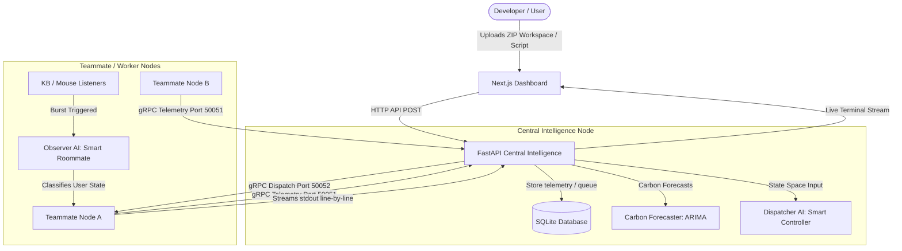

# 🧠 GridMind: Carbon-Aware AI-Driven Distributed Workstation Scheduler

GridMind is a next-generation distributed workstation scheduler that transforms ordinary, underutilized local laptops and workstations into a secure, carbon-intelligent, and high-performance computing (HPC) cluster. 

Unlike traditional cloud-based or rigid data-center cluster orchestrators, GridMind utilizes **Reinforcement Learning**, **Smart Human Observers**, and **Power Grid Forecasting** to schedule compute workloads across office computers—without ever interrupting the developers or office workers sitting in front of them.

---

## 🚀 The Core Innovation: What Makes GridMind Unique?

GridMind is built around **three primary pillars** that distinguish it from any existing solution on the market:

### 1. 🍃 Carbon-Aware Predictive Scheduling
Traditional schedulers are "green-blind"—they only look at how fast a computer is, ignoring where the electricity comes from. GridMind is **natively carbon-conscious**:
*   **Marginal Emissions Signal**: It uses **WattTime's marginal emissions (CO2_MOER)**—the carbon intensity of the *next* MWh the grid would burn to serve new load. This is the correct, decision-grade signal for load-shifting (far better than a grid-wide average), replayed from **8,929 real CAISO data rows**.
*   **Predictive Execution**: If the local power grid is currently burning coal, GridMind's **Dispatcher AI** will proactively **defer** non-urgent tasks (e.g., model retraining) and execute them when the grid transitions to solar, wind, or hydro energy.
*   **Measured Carbon Proof**: For every completed task, GridMind records the emissions a naive scheduler *would have* paid at submit-time versus what GridMind *actually* paid at run-time. Using a stated ~50 W per-node load estimate (applied identically to both sides), it reports the **measured grams of $CO_2$ saved**, the **percentage saved**, and tangible equivalents (phone charges, metres not driven) directly on the live dashboard.

### 2. 🛡️ Invisible Zero-Interrupt Co-Existence (Observer AI)
Traditional grids require dedicated, idle computers that nobody is using. If you run a background task on a developer's machine, it lags, frustrating the user. GridMind introduces **Human-Aware Co-existence**:
*   **Hardware State Classification**: An **Observer AI**—a supervised **scikit-learn RandomForest classifier (99.2% held-out accuracy)**—evaluates hardware telemetry (CPU, RAM, Net I/O) along with keyboard and mouse input event frequencies.
*   **Human Activity Burst Detection**: If a developer touches their keyboard or mouse, a background listener detects the burst.
*   **Emergency Abort & Deferral**: The Node Agent immediately sends a gRPC abort signal, stops the task subprocess instantly to free up 100% of resources for the developer, and the Dispatcher AI re-queues or migrates the task. The human never even realizes a background training task was running.
*   **Respect-the-Human Power & Thermal Protection**: Nodes also report **battery %, on-battery status, and CPU temperature**. The Dispatcher will never dispatch to a machine that is **on battery and below 30% charge, or hotter than 85°C**—it marks them "⛔ Protected." A healthy laptop on battery still helps out, so the cluster works untethered; GridMind borrows your idle compute, never your last 30% of battery or a comfortable lap.

### 3. 🤖 Smart Dispatcher (Reinforcement Learning)
Static rules (like assigning tasks in a simple loop) fail in dynamic office environments where computers turn off, go to sleep, or get used by humans at random.
*   **Deep Reinforcement Learning**: GridMind uses a **Dueling Double Deep Q-Network (DQN)** in PyTorch that maps a 10-feature normalized state space (telemetry, regional carbon index, queue sizes, and priority distributions) to optimal scheduling actions. The policy is served from a **native `.pt` state-dict on CPU** (no ONNX, no GPU dependency), returning a decision in **under 10 ms**.
*   **Adaptive Policy**: The agent learns over time which nodes are most reliable, when certain developers go to lunch (enabling larger window dispatches), and how to maximize carbon efficiency without missing task deadlines.

---

## 📊 Comparative Analysis: GridMind vs. The Industry

| Feature / Aspect | Slurm / HTCondor | Kubernetes (K8s) | GridMind (Our Project) |
| :--- | :--- | :--- | :--- |
| **Primary Focus** | Bare-metal HPC performance | Cloud-native microservices | **Eco-Friendly Local Edge Computing** |
| **Grid Awareness** | ❌ None | ❌ None | **✅ Regional Carbon-Intensity Aware** |
| **Scheduling Engine** | Static Heuristics / Priority | Static Resource Limits (Go scheduler) | **🧠 Reinforcement Learning (DQL)** |
| **Co-Existence Concept** | Headless / Dedicated Nodes only | Hard Limits (Eviction under stress) | **🛡️ Real-Time Human Activity Burst Abort + Battery/Thermal Protection** |
| **Fault Tolerance** | Job requeue (operator-configured) | Pod reschedule (controller) | **♻️ Auto Re-Dispatch on Node Drop (≤3 retries, then honest failure)** |
| **Data-Parallel Speedup** | Manual job arrays / MPI setup | Manual sharding via manifests | **🔀 One-Click Job Splitting Across Free Nodes (measured speedup)** |
| **Target Infrastructure** | Dedicated Data Centers | AWS, GCP, Azure, Private Cloud | **💻 Existing Office Workstations & Laptops** |
| **Telemetry System** | Pull-based (cron/agent) | Metrics Server (Prometheus) | **⚡ Async gRPC + Real-Time WebSocket Streaming** |
| **Developer Experience** | Command line / CLI only | Complex YAML files | **🎨 Elegant Glassmorphism Next.js Dashboard** |

---

## 🛠️ Simple Explanations: The AI Under the Hood

To make GridMind work seamlessly, three specialized AI systems collaborate in real-time. Here is how they work in simple terms:

### 1. The Dispatcher AI (The Smart Traffic Controller)
*Analogy: An experienced logistics manager at a shipping company who learns over time which routes are fastest and cheapest.*

Instead of following rigid, pre-defined rules, the Dispatcher AI **learns by trial and error** using a technique called **Reinforcement Learning** (specifically a *Dueling Double Deep Q-Network*).

*   **How it Works**: It looks at 10 different signals (like how busy the workstations are, how clean the power grid is, and how urgent the task is) and decides which machine should execute the task.
*   **The "Dueling" Concept**: The AI splits its thinking into two paths:
    1.  **State Value**: It looks at the *overall situation* of the network to see if it is a good time to dispatch tasks at all.
    2.  **Action Advantage**: It looks at *which specific workstation* is the absolute best candidate for the job.
    *By separating these two questions, the AI makes smarter decisions much faster.*
*   **The "Double" Concept (The Two-Judge System)**: 
    Instead of relying on a single network to make a decision and grade its own work, GridMind uses a "two-judge" system. One network proposes where to send the task, and a second network double-checks that choice. This prevents the AI from making hasty, overly-optimistic scheduling errors.

### 2. The Observer AI (The Polite Roommate)
*Analogy: A polite roommate who immediately stops playing music the second they hear you walk into the room so they don't disturb you.*

The Observer AI runs silently in the background of each workstation to ensure that remote tasks never slow down the machine for the person sitting in front of it.

*   **How it Works**: It monitors 7 factors (like CPU, RAM, and how actively the keyboard and mouse are being used) and classifies the machine's state into:
    *   **Idle**: The user is away; it is 100% safe to run background work.
    *   **Active User**: A human is using the computer; stop all background tasks immediately!
    *   **Busy Hardware**: The machine is working on something else, but no human is actively sitting there.
*   **The "Waiting Window" (Temporal Smoothing)**: 
    If a user accidentally bumps their desk or hits a single key by mistake, we don't want to panic and abort a massive 2-hour job. The AI uses a "smoothing filter"—it observes activity over a brief, **configurable** temporal window (a rolling buffer of recent frames). It only triggers a task abort if it is highly confident, across that window, that a human is *actually* back at their computer actively working.

### 3. The Carbon Forecaster (The Green Weather App)
*Analogy: A weather forecast app that tells you it will stop raining in 30 minutes, so you wait to go for a walk.*

Rather than just reacting to the grid in the present moment, the Carbon Forecaster predicts the future to optimize green energy usage.

*   **How it Works**: It uses a classic time-series forecasting model (called **ARIMA**), fit at startup on the real WattTime marginal-emissions series. This same model powers the Dispatcher's **explainable reasoning** ("deferring because the grid is dirty now but a clean window opens soon").
*   **2-Hour Horizon**: It produces a rolling **2-hour outlook** of where the local grid's carbon footprint is heading.
*   **The Smart Delay**: If the model predicts that the grid is currently dirty (burning coal) but a wave of clean solar energy will hit the grid in 30 minutes, the Dispatcher AI will temporarily hold back non-urgent tasks in the queue. It dumps them onto the machines only when the clean window begins, maximizing carbon savings.

---

## ⚙️ How GridMind Works Under the Hood



### 1. The Real-Time Connection (gRPC & WebSockets)
To coordinate computers seamlessly without lagging:
*   **Continuous Check-in (gRPC Telemetry)**: Every 5 seconds, each workstation checks in with the master server, sharing its hardware load and whether a human is active.
*   **Live Output Streaming (gRPC to WebSockets)**: When a node is running a task, it doesn't wait until the task is fully finished to show the results. It streams the console output line-by-line in real-time directly to the dashboard, making it look like a live terminal.

### 2. Workspace Artifact System & Flexible Remote Execution
Developers submit work three ways: a **raw script**, a **single `.py` file** (drag-and-drop upload from the dashboard), or a **fully packaged `.zip` workspace**. For a workspace, the worker node automatically downloads it, extracts it locally, executes the entry script in an isolated subprocess, packages the generated artifacts (e.g., trained weight files, graphs, CSVs), and uploads the output workspace back to the server for the user to download.

### 3. Fault-Tolerant Re-Dispatch
Office laptops are unreliable by nature—someone closes a lid, drops Wi-Fi, or walks away. GridMind treats this as a first-class case, not a crash:
*   If a node **disconnects mid-task**, the task is automatically **re-queued** and a different free node picks it up and finishes it.
*   This retries up to **3 times**. If every attempt is exhausted, GridMind reports an **honest failure** rather than silently dropping the work.

### 4. Data-Parallel Job Splitting (The Mini-Supercomputer Payoff)
This is where a room full of laptops becomes a single machine. A user can split **one job into N chunks**, and GridMind fans them out **one-per-free-node** to run concurrently:
*   Each node receives its slice of the work via the `GRIDMIND_CHUNK_INDEX` / `GRIDMIND_CHUNK_COUNT` environment variables, so the same script knows exactly which portion to compute.
*   When **two or more nodes share the work**, the dashboard surfaces the **measured speedup**—turning idle desks into tangible, parallel horsepower.

### 5. Honest, Real Results
GridMind never fakes success. Every task reports its **real status and exit code** straight from the remote subprocess. When a user clicks cancel, the server sends an **`AbortTask`** RPC that genuinely kills the remote subprocess—stop means stop.

---

## 🎬 Guided Walkthrough — Follow One Task End-to-End

*This is the narrative to walk a panel through while the live demo runs. Each scene names the real mechanism, file, and port behind it.*

### Scene 0 — Booting the master (`python start_gridmind.py`)
One command brings the whole "central intelligence" online. The launcher (`start_gridmind.py`) starts services in dependency order:
1. **FastAPI server** (`uvicorn`, port **8000**). On startup (its `lifespan`) it: initialises the **SQLite** task database (WAL mode), loads the **Observer AI** (a scikit-learn RandomForest), loads the **Dispatcher AI** (a PyTorch Dueling-DQN `.pt` on CPU), loads the real **WattTime carbon series** and fits the **ARIMA** forecaster, and launches the **2-second dispatcher loop**.
2. **Async gRPC telemetry server** (port **50051**) — this is the master's "inbox" where every worker streams its vitals.
3. **Next.js dashboard** (port **3005**) — served as a **production build** (`next start`) so it loads instantly and can't stall.
4. **Local node agent** — the master's own laptop also joins as a worker.

> Technical detail: a launch guard checks `/api/v1/health` first and **refuses to start a second copy**, so an accidental double-launch can't kill the running cluster. There's no `--reload`, so editing a file never restarts (and crashes) the backend mid-demo.

### Scene 1 — A teammate's laptop joins the cluster
A teammate runs **one command**:
```bash
python gridmind_node/agent.py --server <MASTER_IP>:50051 --node-id "Ishmeher"
```
The agent does two things: it **opens its own inbound gRPC task-server on port 50052** (so the master can later push work *to* it), and it **opens a streaming gRPC channel out to the master on 50051**. If the master is briefly unreachable, the agent retries with **exponential backoff** — nodes self-heal.

> Technical detail: telemetry flows **out** (worker → master :50051); task dispatch flows **in** (master → worker :50052). That's why a worker's firewall must allow inbound 50052 and the master's must allow inbound 50051.

### Scene 2 — Data collection (the telemetry heartbeat)
Every **5 seconds**, each agent's collector (built on **`psutil`** for hardware and **`pynput`** for input) gathers a snapshot: **CPU %, RAM %, keyboard events/min, mouse events/min, network I/O, process count**, plus **battery %, on-battery state, and CPU temperature**. It streams this to the master over the gRPC channel — a continuous, low-overhead heartbeat (each agent uses <2% CPU).

### Scene 3 — The master "understands" each laptop (Observer AI)
For every telemetry snapshot, the master runs the **Observer AI** — a **RandomForest classifier (99.2% held-out accuracy)** that maps the 7 signals to one of three states: **`idle`**, **`active_user`**, or **`busy_hardware`**, with a confidence score. To avoid panicking on a single stray keystroke, it applies **temporal smoothing** (a majority vote over a rolling, configurable window). The result lands in the master's in-memory **`NodeRegistry`**, and a **`node_update`** message is pushed over **WebSocket** to the dashboard — which is why the node cards update live.

> Technical detail: a telemetry packet missing a field can't crash the stream — the registry reads every field defensively (`.get` with defaults).

### Scene 4 — Submitting a task
On the dashboard, the user **drops a `.py` file**, types a script, or uploads a **`.zip` workspace**. This `POST /api/v1/tasks` stores the task in SQLite as **`pending`** and **stamps the current grid carbon** at submit-time (the naive "run it now" baseline, used later to prove savings). Nothing executes yet — it joins the queue.

### Scene 5 — The decision (Dispatcher AI, every 2 s)
The dispatcher loop wakes every 2 seconds and builds a **10-feature normalized state vector**: queue depth, current carbon intensity, the idle/active/busy node ratios, average CPU/RAM, and the urgent/deferrable/best-effort mix. It feeds this to the **Dueling Double DQN** (PyTorch, CPU) which returns **defer (0)** or **dispatch (1)** in **under 10 ms**. Two transparent **guardrails** can override the learned policy: **urgent work runs now** regardless of carbon, and a **clean grid forces a dispatch**. Before choosing a node it applies the **power/thermal filter** — a node that's on battery *and below 30%*, or hotter than 85 °C, is skipped (**⛔ Protected**) — then picks the safest free idle node (lowest CPU).

> Technical detail: the task is **claimed atomically** (`UPDATE … WHERE status='pending'` with a row-count check) so the same task can never be double-dispatched or revived after a cancel.

### Scene 6 — Dispatch & execution (the task lands on a worker)
The master opens a gRPC channel to the chosen worker's **:50052** and sends a **`TaskPayload`** (script, timeout, priority, and chunk info). The worker's **executor** writes the script to a temp file (**UTF-8**, so em-dashes/emojis don't break it), spawns it in an **isolated subprocess**, and **streams stdout back line-by-line** over the gRPC stream. The master rebroadcasts each line over WebSocket, so the dashboard shows a **live terminal**.

> Technical detail (the "respect-the-human" moment): if the worker's owner touches the keyboard/mouse mid-task, a **burst detector** fires, the executor **kills the whole process tree** instantly, and the task is re-queued — the human never feels a lag. Output is capped and the kill runs off the event loop so telemetry never freezes.

### Scene 7 — Result, honest status & carbon proof
When the subprocess finishes, the worker sends a **terminal status** with the **real exit code**; the master writes status/stdout/stderr/duration to SQLite — **no faked successes**. The **carbon ledger** then records the emissions a naive scheduler *would have* paid (submit-time carbon) vs what GridMind *actually* paid (run-time carbon), using a stated ~50 W estimate, and surfaces **grams of CO₂ saved + % reduction + tangible units** on the dashboard.

> Technical detail (fault tolerance): if the worker disconnects mid-task (lid closed, Wi-Fi drop), the master detects the broken stream, **re-queues the task to another free node (up to 3 retries)**, and only reports an **honest failure** if every attempt is exhausted — it never silently loses work or leaves a task stuck "running".

### Scene 8 — The mini-supercomputer: data-parallel chunk splitting
This is where a room of laptops becomes one machine. The user submits **one job split into N chunks** (`POST /api/v1/jobs`, `chunks=N`). The backend creates **N child tasks that share a `parent_job_id`**, each tagged `chunk_index = 0…N-1`. They ride the normal dispatch path, so the loop **fans them out one-per-free-node** — on N free nodes they run **simultaneously**. Every node runs the **identical script**, but reads its slice from the **`GRIDMIND_CHUNK_INDEX` / `GRIDMIND_CHUNK_COUNT`** environment variables:
```python
block = MAX // n
lo, hi = i*block, (i+1)*block   # this node scans only [lo, hi)
```
As chunks finish, the dashboard shows the **measured speedup** = `serial_secs` (sum of all chunk times) ÷ `wall_secs` (first dispatch → last completion). On 4 nodes that's ≈4×.

> Technical detail: if there are **fewer free nodes than chunks**, the extras simply queue and run in **waves** as nodes free up — the whole range is always covered, the speedup is just whatever genuinely happened. The multiplier is **only shown when ≥2 nodes actually shared the work**, so it's never misleading.

### Scene 9 — Looking ahead (the Carbon Forecaster)
Running quietly alongside, the **ARIMA forecaster** produces a rolling **2-hour outlook** of grid carbon. It powers the dashboard's "Grid Outlook" strip and the Dispatcher's **explainable reasoning** ("deferring now — grid is dirty, a clean window opens in ~35 min"), so deferral decisions are transparent, not a black box.

**The one-sentence version for the panel:** *"You drop a script on a dashboard; a reinforcement-learning scheduler waits for clean power and an idle laptop, ships the work over gRPC to a teammate's machine, streams the output back live, instantly backs off the moment that teammate touches their keyboard, proves how much CO₂ it saved — and can split one job across every free laptop in the room at once."*

---

## 👥 Team & Work Distribution (4 Members)

GridMind splits cleanly along its architecture, so each member owns one coherent subsystem end-to-end while sharing the integration seams (the gRPC contract and the dispatcher state vector). *Names/roles can be swapped to match your team.*

| Member | Role | Subsystem | Owns (key files) |
| :--- | :--- | :--- | :--- |
| **Mudit Saxena** | Systems & Integration Lead | Central server, orchestration, data layer | `start_gridmind.py`, `gridmind_server/app/main.py`, `routes/` (`tasks.py`, `nodes.py`, `jobs.py`), `db/database.py`, `task_dispatcher.py`, `jobs/dispatcher_loop.py`, `websockets.py`, `registry.py` |
| **Ananya** | AI / ML Engineer | The two models + carbon intelligence | `ml/observer_trainer.py`, `ml/observer_inference.py`, `ml/dispatcher_trainer.py`, `ml/dispatcher_env.py`, `ml/dispatcher_inference.py`, `carbon/forecaster.py`, `carbon/ledger.py`, `models/`, `data/` |
| **Raj** | Node & Remote-Execution Engineer | The worker layer | `gridmind_node/agent.py`, `gridmind_node/executor.py`, `protos/telemetry.proto` (+ generated `*_pb2`), `demo_tasks/` |
| **Ishmeher** | Frontend & UX Engineer | The live dashboard | `frontend/src/app/` (`page.tsx`, `layout.tsx`, `globals.css`), `frontend/src/hooks/useGridMindSocket.ts`, `frontend/src/lib/` (`api.ts`, `types.ts`), `frontend/src/components/dashboard/*` |

### What each member built

**1. Mudit Saxena — Systems & Integration Lead.** Built the FastAPI "central intelligence" master: the REST API (task submission, cancel/clear, artifact up/download, jobs), the hand-rolled async SQLite data layer (WAL), the 2-second dispatcher loop that fans tasks out across free nodes, the in-memory node registry, fault-tolerant re-dispatch (≤3 retries → honest failure), the WebSocket broadcaster, and the one-command launcher that brings the whole stack up. *Demo line: "I own how the cluster makes and tracks every decision."*

**2. Ananya — AI / ML Engineer.** Trained and serves both models: the **Observer** (scikit-learn RandomForest, 99.2% held-out, with the confusion matrix + classification report) and the **Dispatcher** (Dueling Double DQN in PyTorch, the `GridMindEnv` reward design, sub-10ms `.pt` inference). Also owns the **carbon** stack — the ARIMA forecaster, the marginal-emissions replay, and the measured carbon-savings ledger — plus the honest evaluation matrices on the dashboard. *Demo line: "I own the intelligence — when to run, where, and how green."*

**3. Raj — Node & Remote-Execution Engineer.** Built the worker side: the node agent (psutil + pynput telemetry, battery/thermal reporting, active-user burst detection, the inbound gRPC task server, reconnection/backoff) and the executor (isolated subprocess execution, live stdout streaming, timeout/abort with whole-tree kills, UTF-8 safety, zip-slip-safe artifacts, data-parallel chunking). Also designed the gRPC `telemetry.proto` contract and the real demo compute tasks. *Demo line: "I own everything that runs on a teammate's laptop — safely."*

**4. Ishmeher — Frontend & UX Engineer.** Built the entire Next.js 16 / React 19 dashboard and its "living energy instrument" design system: the carbon-reactive UI, the live WebSocket hook (with auto-reconnect + REST fallback), the carbon gauge/chart/forecast, node health cards, the dispatcher action log, the task-submission panel (drag-drop, history, remove), the data-parallel job panel, and both model-evaluation matrices + the performance-stats section. *Demo line: "I own the single pane of glass the whole demo is shown on."*

### Shared / collaborative work
- **Integration seams** (everyone): the gRPC contract (`protos/telemetry.proto`) couples Raj's nodes ↔ Mudit's server; the 10-feature dispatcher **state vector** couples Mudit's loop ↔ Ananya's model — these were agreed and kept in sync across members.
- **Docs, demo runbook, and testing** were a shared effort (`README.md`, `TEAM_UPDATE.md`, `DEMO_RUNBOOK.md`, the review/pitch decks).

---

## 🌟 Why GridMind is the Future of Edge Computing

1. **Zero Hardware Costs**: Organizations do not need to buy expensive servers. They can use the idle computing power of their developers' and designers' existing machines (which sit idle 70-80% of the day).
2. **True ESG Compliance**: Instead of greenwashing, companies can actively schedule heavy machine learning workloads and simulations to run *only* when the grid power is clean, directly contributing to carbon footprint reduction.
3. **Frictionless Integration**: Teammates can connect their local machine to the master orchestrator in literally one second with a single terminal command:
   ```bash
   python gridmind_node/agent.py --server <MASTER_IP>:50051 --node-id "Your_Name"
   ```

GridMind represents a paradigm shift: **making distributed computing smart, green, and completely invisible.**
